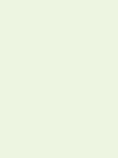

# Сайт - форум (zenum)

## Создание

Для создания базы данных используйте скрипт rebase.sh

Поля для изменения:

```shell
$LOCAL_PATH - укажите путь к проекту
$USER_COUNT - кол-во пользователей для рандомного добавления в БД
$QUESTION_COUNT - кол-во вопросов
$MAX_COUNT_ANSWERS_IN_QUESTION - максимальное кол-во ответов на вопросы
$COUNT_RATING_PER_QUESTION - кол-во голосов для каждого вопроса (умножаем)
```

## Используемая палитра:



